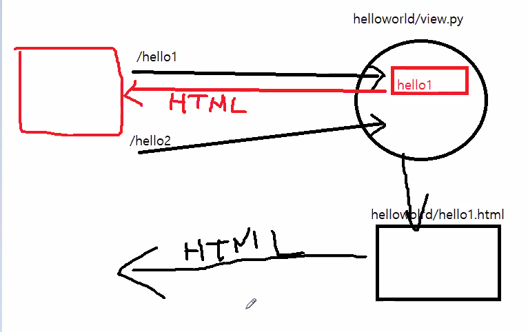
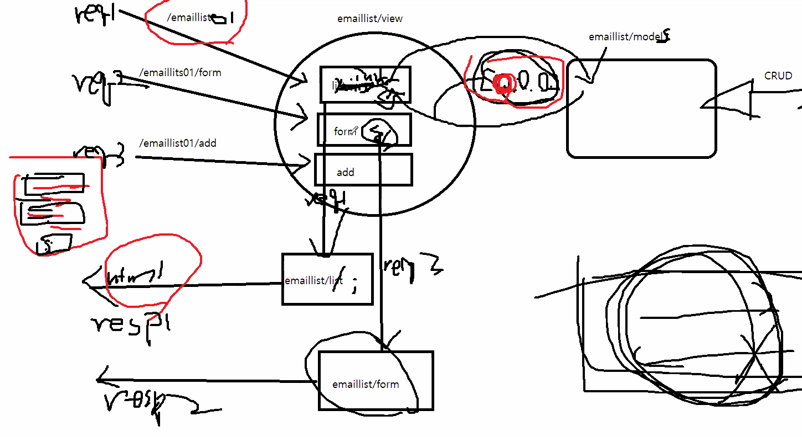
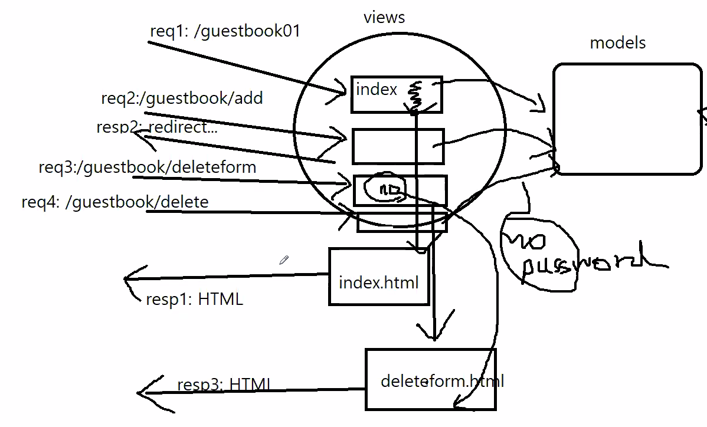

# 210405

============= 앞으로 할 것들 ==================
django-practives
    |---helloworld
    |---emaillist01
    |---guestbook01[과제]   
    |---emaillist02          
    |---guestbook02[과제]

01:Model(SQL)
02:Model(ORM) 
이렇게 두가지 버전이 있음

- ORM
```python
    e = emaillist()
    e.firstname = ''
    e.lastname = ''
    e.email = ''
    e.save();
```

mysite (01버전으로 함)
    |---user
    |---guestbook[과제]
    |---board[평가과제 : 계층형게시판]
 
배포(AWS,Beanstalk)

============== 이제하는거 =================

django_practices\urls.py
django_practices\settings.py
tempatets\hellotworld
helloworld\view.py
얘네를 많이 사용

이런 형식으로 진행이 됨


emaillist01 그림

