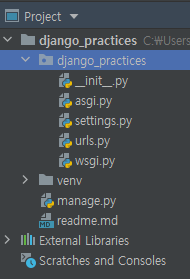
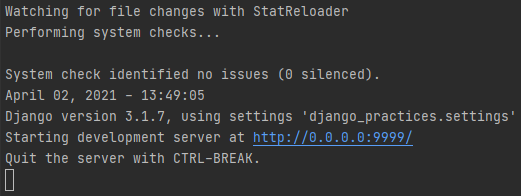
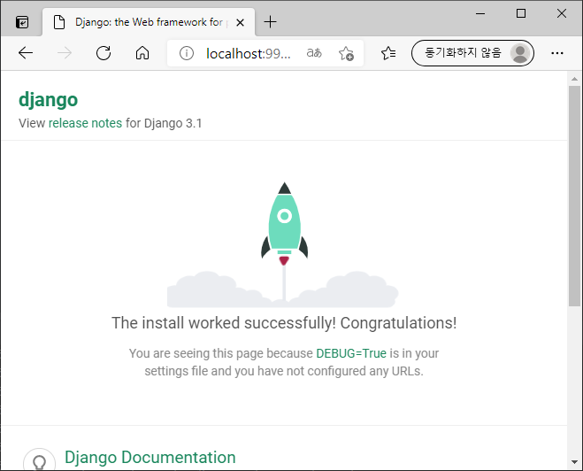

# Django Practices

## 장고 프로젝트 (django_practices) 만들기

### 1. pycharm에서 프로젝트 생성

### 2. django library 설치 (터미널에서)
````shell
(env) # pip install django
````
### 3. mysqlclient library 설치
```shell
(env) # pip install mysqlclient
```

### 4. 장고 프로젝트 생성
```shell
(env) # django-admin startproject django_practices
```

### 5. 디렉토리 정리 (pycharm 프로젝트와 장고 프로젝트를 일치시켜주기)



### 6. 초기 설정 (settings.py)
1) time zone 설정
```python
TIME_ZONE = 'Asia/Seoul'
```
2) database 설정<br>
    장고는 기본적으로 설치되는 관리 웹어플리케이션이 내장되는데, 그 관리 어플리케이션이
    이미 db를 쓰고 있기 때문에 바꿔줘야함
```python
DATABASES = {
    'default': {
        'ENGINE': 'django.db.backends.mysql',
        'NAME': 'webdb',
        'USER': 'webdb',
        'PASSWORD': 'webdb',
        'HOST': 'localhost',
        'PORT': 3306
    }
}
```

### 7. 장고 프로젝트의 관리 어플리케이션(기본으로 설치 됨)이 사용하는 DB 생성하기
```shell
(env) # python manage.py migrate
```

### 8. 프로젝트(사이트) 관리 계정 만들기
```shell
(env) # python manage.py createsuperuser
Username (leave blank to use 'dpswp'): admin
Email address: seeoonghoo@gmail.com
Password: (여긴 맨날 쓰던거 함)
Password (again):
Superuser created successfully.
```

### 9. 지금까지 작업 내용 확인
1) 서버 시작하기<br>
     <BR>
    이렇게 되면 실행이 되는 것 (아래꺼를 먼저 해야 이게 실행이 됨)
```shell
(env) # python manage.py runserver 0.0.0.0:9999
여기서 0.0.0.0 허용할 ip (모두 허용한다)
```


2) 브라우저로 접근하기 <br>
url http://localhost:9999 로 접근
   
   
---------------------------------------------------------------------

## 2. 프로젝트(django_practices)에 Application 추가하기

### 1. Application들의 통합 template 디렉토리 templates 만들기
1) 디렉토리 생성
django_practices
|--- templates
   
2) template 디렉토리 설정 (settings.py)
```python
import os

'DIRS': [os.path.join(BASE_DIR, 'templates')]
#BASE_DIR 은 최상위 디렉토리, templates 는 디렉토리인데 join 저걸로 디렉토리를 함쳐줌
 ```

### 2. helloworld application 만들기
1) application 생성
```shellworld
(venv) # python manage.py startapp helloworld
```

2) application 등록 (settings.py)
```python
INSTALLED_APPS = [
    'helloworld',
    'django.contrib.admin',
    'django.contrib.auth',
    'django.contrib.contenttypes',
    'django.contrib.sessions',
    'django.contrib.messages',
    'django.contrib.staticfiles',
]
```

3) application의 template 디렉토리 생성
django_practices
|--- templates
    |--- helloworld
   
4) urls.py 에 URL 등록하고 views.py 에 요청 처리 
   함수만들고 template(html) 연결하고..... (반복반복)
   
### 웹에 띄우기

1. 뭐 만든다
2. 올리고자 하는 application 에 있는 view.py 파일에 파일 걸어서 리턴해준다.
3. 그걸 urls.py 에 등록해준다.
4. 된다.

- 참고
    - 원하는 application의 view.py 파일에서
    templates 디렉토리는 자동으로 인식이 되는 듯 하다. 
    templates/test 가 아닌, test만 해도 인식이 됨.
    여기서 함수를 만들어서 리턴 렌더 해서 해주면 된다.
    - urls.py 에는 위에서 지정한 application의 view 파일을 임포트하고
    거기서 view.py 에서 만들었던 함수를 호출해주면 거기에 맞는 링크와 함께 보여짐